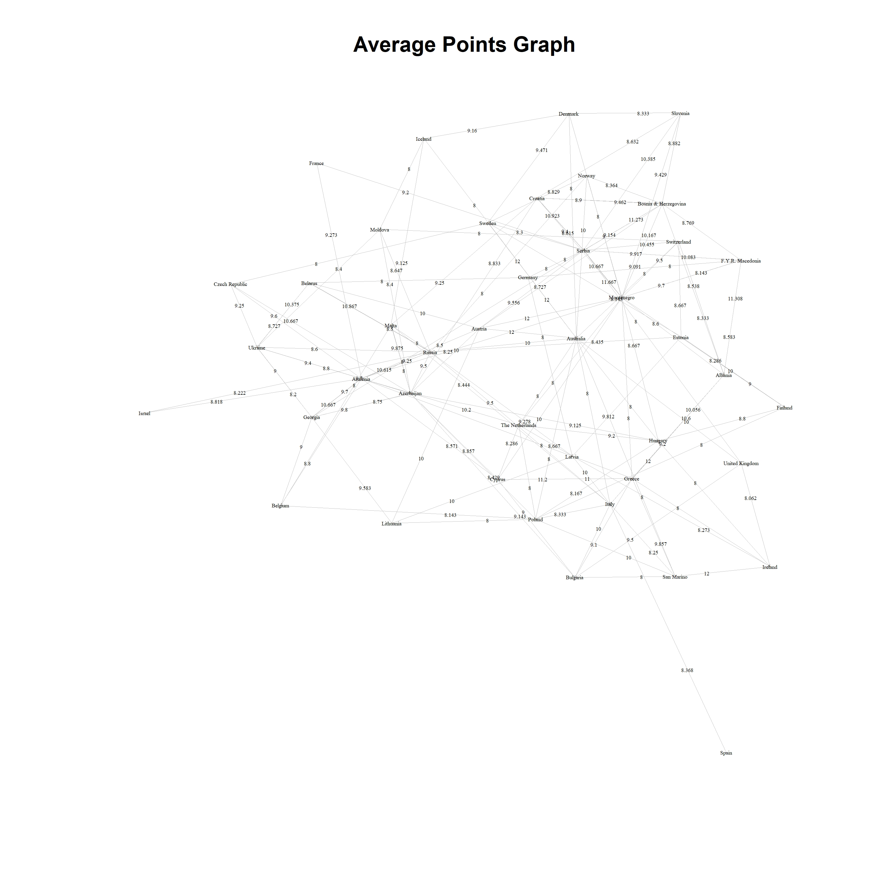

## Overview

This Rmarkdown file generates voting blocs for the Eurovision Song Contest (ESC) using historical voting data. Network analysis is used to generate the voting blocs, and the resulting categorical voting bloc information is used as independent variables to explain contest scores. The presence of Voting blocs within the ESC has been noted by both commentators and academics for many years. 

```{r preliminaries, message = FALSE, echo = FALSE}
# Load in relevant libraries
library(rmarkdown)
library(knitr)
library(igraph)
library(dplyr)
# load in custom utility functions
source("./scripts/utilities/graph_network.R")
source("./scripts/utilities/plot_dendrogram_chart.R")
```

## Data Profiling / Preparation

The historical voting data records the number of points given from one country to another across the various years of the ESC. The historical voting data is further subdivided by round, either semi-final or final, and by voting method, either jury or televote.

```{r data-profiling, echo = FALSE}
# load in the historic voting data for deriving the voting blocs
past_voting_data <- read.csv(file = "./data/ESC_hist_voting_data.csv", header = T)
# get the head of the data
head(past_voting_data)
```

### Average Points Dataframe

The historical voting data between all 'from country' and 'to country' combinations are aggregated across the years and the average number of points is calculated.

```{r average-vote-matrix, message = FALSE, echo = FALSE}
# Average over the voting data
pvd <- past_voting_data %>% 
       select(From.country, To.country, Points) %>%
       group_by(From.country, To.country) %>%
       summarise(Average.Points = mean(Points)) %>%
       as.data.frame()

# show head of data
head(pvd)

# write the average voting data to a csv file
write.csv(x = pvd, file = "./data/average_points.csv", row.names = F)
```

### Average Points Graph

The aggregated historical voting data is further filtered to return cases where the average number of distributed points is greater than 8.

```{r average-points-graph, echo = FALSE, results = 'hide'}
# graph the data based on the weight of the average point score
# assumption: an average point score of 8 or more is a sign of bloc voting
pvdf <- filter(pvd, Average.Points >= 8)
G <- graph_from_data_frame(d = pvdf, directed = T)
E(G)$weight <- as.numeric(pvdf$Average.Points)
# check the graph is weighted
if (is_weighted(G) == FALSE){
  stop("Voting Network Graph is Unweighted.")
}
# plot the average points graph
graph_network(dataset = pvdf, 
              main = "Average Points Graph",
              from.country = 'From.country', 
              to.country = "To.country", 
              weights = 'Average.Points',
              output_fpath = './report/plots/networks/average-points-graph.jpg'
              )
```

\newline

## Voting Blocs

The two network clustering algorithms used are edge betweenness clustering, and short random walks. The connectedness of the clusters / communities are evaluated using modularity. The modularity of a graph with respect to some division (or vertex types) measures how good the grouping is. The higher the modularity the greater the division between communities and the better grouping

### Edge Betweenness Clustering

```{r edge-between-clustering, warning = FALSE, echo = FALSE, results = 'hide'}
# Perform Edge between clustering
com1 <- cluster_edge_betweenness(graph = G, weights = E(G)$weight)
# create a data frame out of the clustering results
com1df <- as.data.frame(cbind(com1$names, com1$membership))
colnames(com1df) <- c("Country", "Group")
```

Edge betweenness clustering works by iteratively removing edges with the highest edge betweeness score from the graph until no edges remain. This results in a dendrogram between when points when the graph is a single component and when the graph is fully disconnected. The number of clusters generated by edge betweenness is `r max(com1$membership)`. The modularity for the edge betweenness clusters is `r round(modularity(com1), 4)`.

```{r edge-betweenness-clustering-results, echo = FALSE, results = 'hide'}
# construct a dendrogram (hierarchical clustering method)
plot_dendrogram_chart(community = com1, 
                      main = "Dendrogram of Edge Betweenness Clustering",
                      output_fpath = './report/plots/dendrograms/edge-betweenness-dendrogram.jpg')
```

\newline

### Short Random Walks

```{r short-random-walks, echo = FALSE, results = 'hide'}
# perform short random walks clustering
com2 <- cluster_walktrap(graph = G, weights = E(G)$weight)
# create a data frame out of the clustering results
com2df <- as.data.frame(cbind(com2$names, com2$membership))
colnames(com2df) <- c("Country", "Group")
```

Short random walks clustering works by performing short random walks between nodes in a graph. Vertices within common communities will tend to occur together more frequently during the short random walks. The number of clusters generated by short random walks is `r max(com2$membership)`. The modularity for the short random walks clusters is `r round(modularity(com2), 4)`.

```{r short-random-walks-results, echo = FALSE, results = 'hide'}
# construct a dendrogram (hierarchical clustering method)
plot_dendrogram_chart(community = com2, 
                      main = "Dendrogram of Short Random Walks Clustering",
                      output_fpath = './report/plots/dendrograms/short-random-walks-dendrogram.jpg')
```

\newline

### Combined Voting Blocs

Here the edge betweenness and short random walks voting blocs are combined into a single dataframe for further analysis later on.


```{r voting-blocks-dataframe, echo = FALSE}
# combine results over both clustering methods into a data frame
voting_bloc_data <- as.data.frame(cbind(com1$names, com1$membership, com2$membership))
# assign column names to the output data frame
colnames(voting_bloc_data) <- c("Country", "VBlocs1_EB", "VBlocs2_SRW")
# results
voting_bloc_data
# Writing Voting Bloc Data to csv file
write.csv(x = voting_bloc_data, file = "./data/voting_bloc_data.csv", row.names = F)
```
