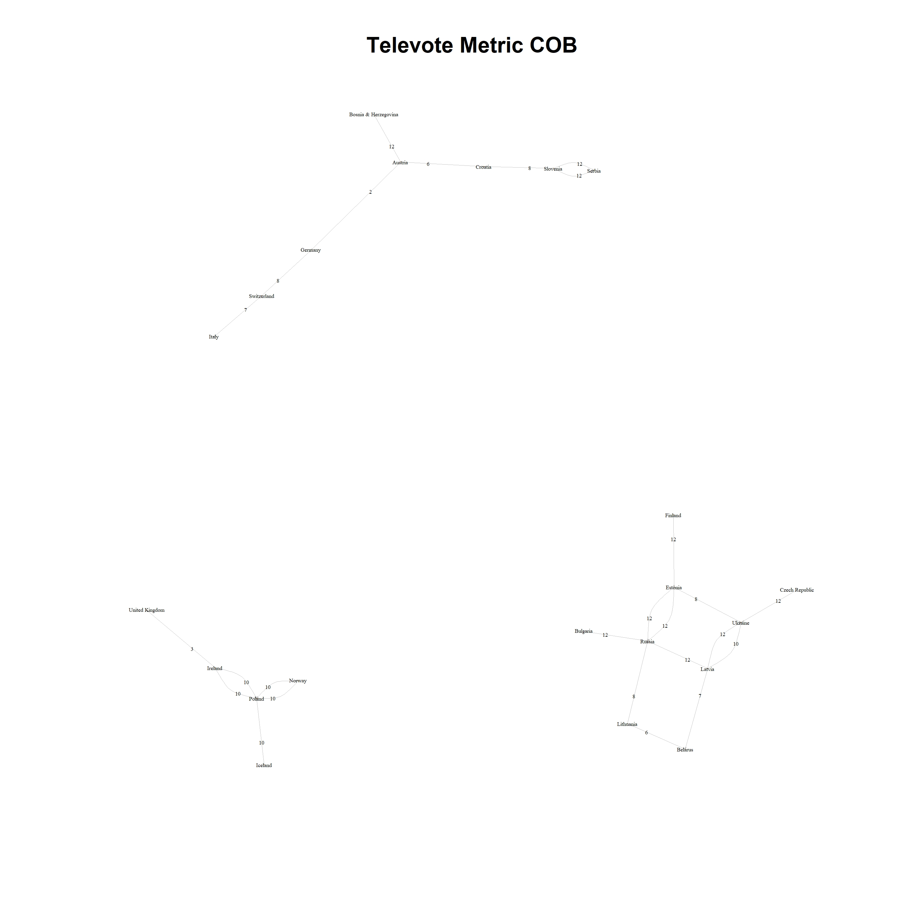
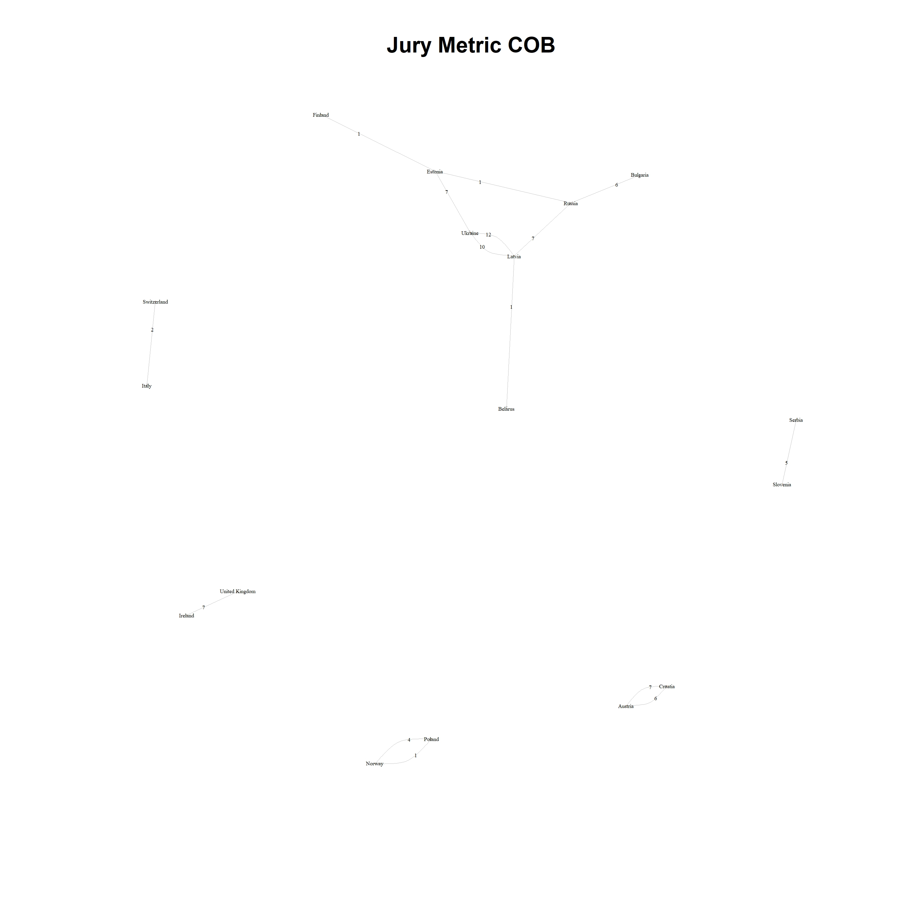
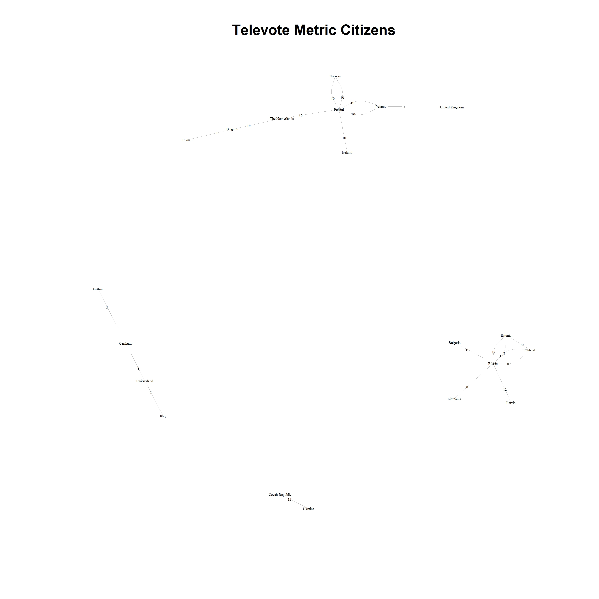
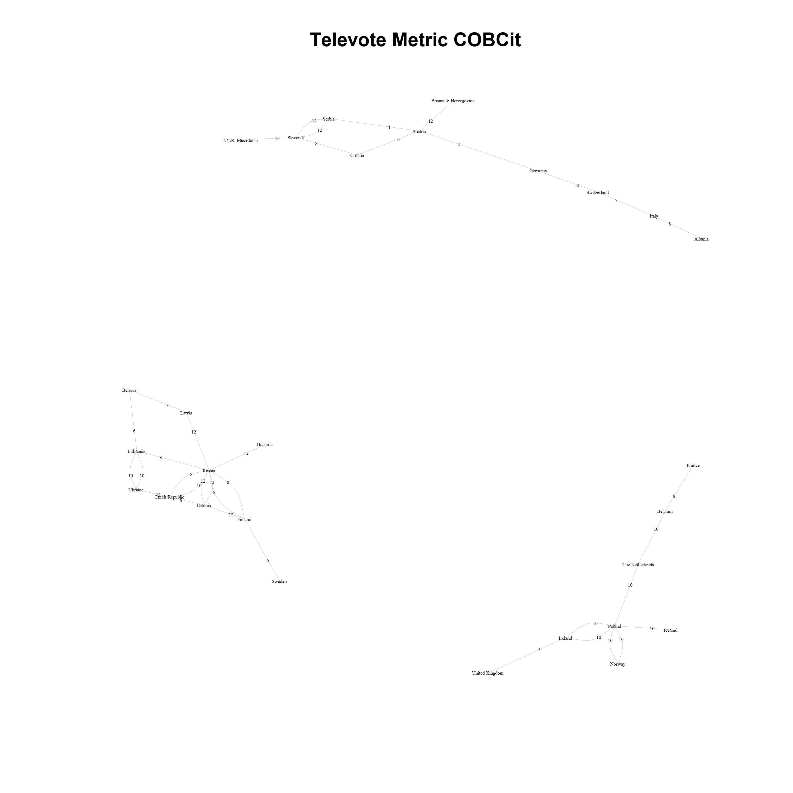
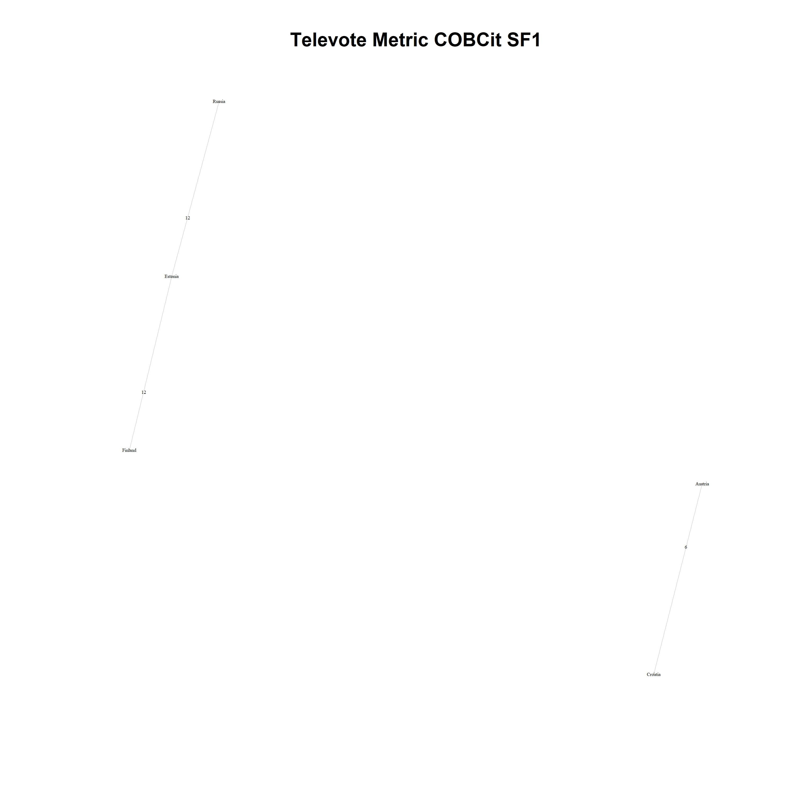
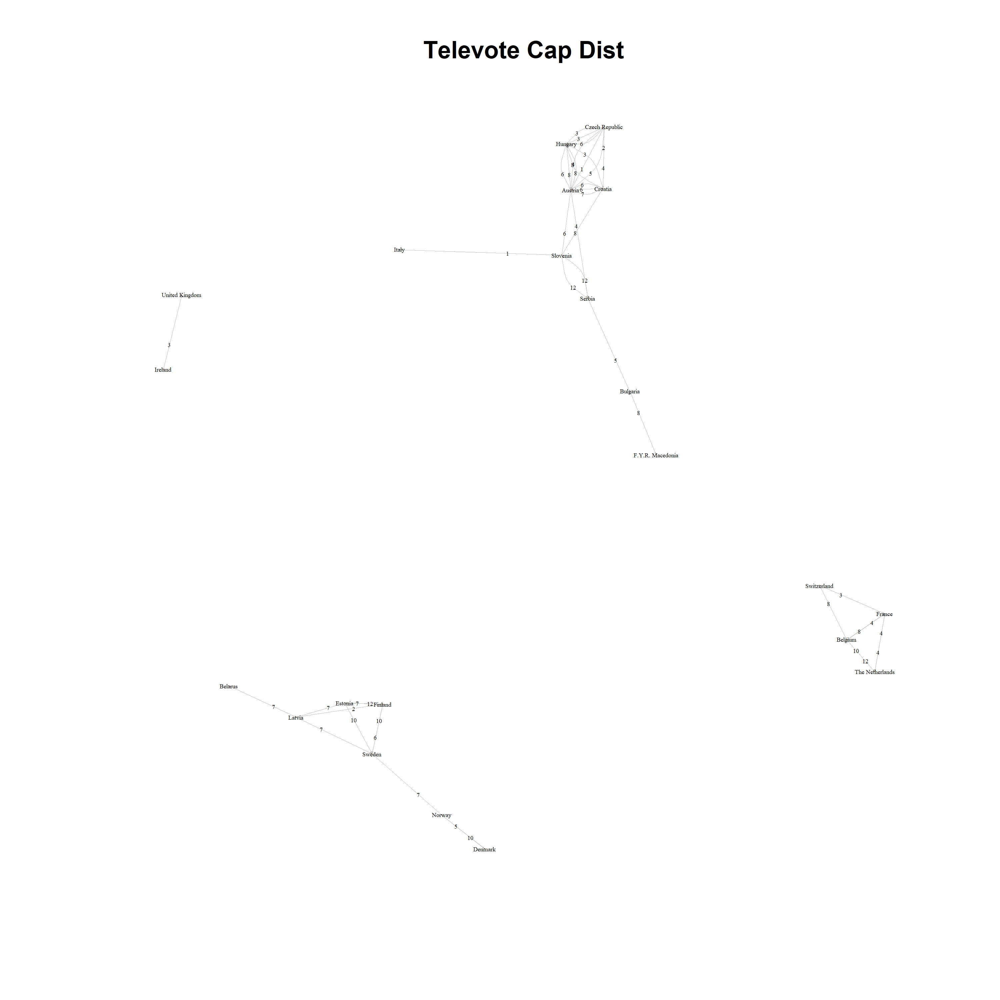
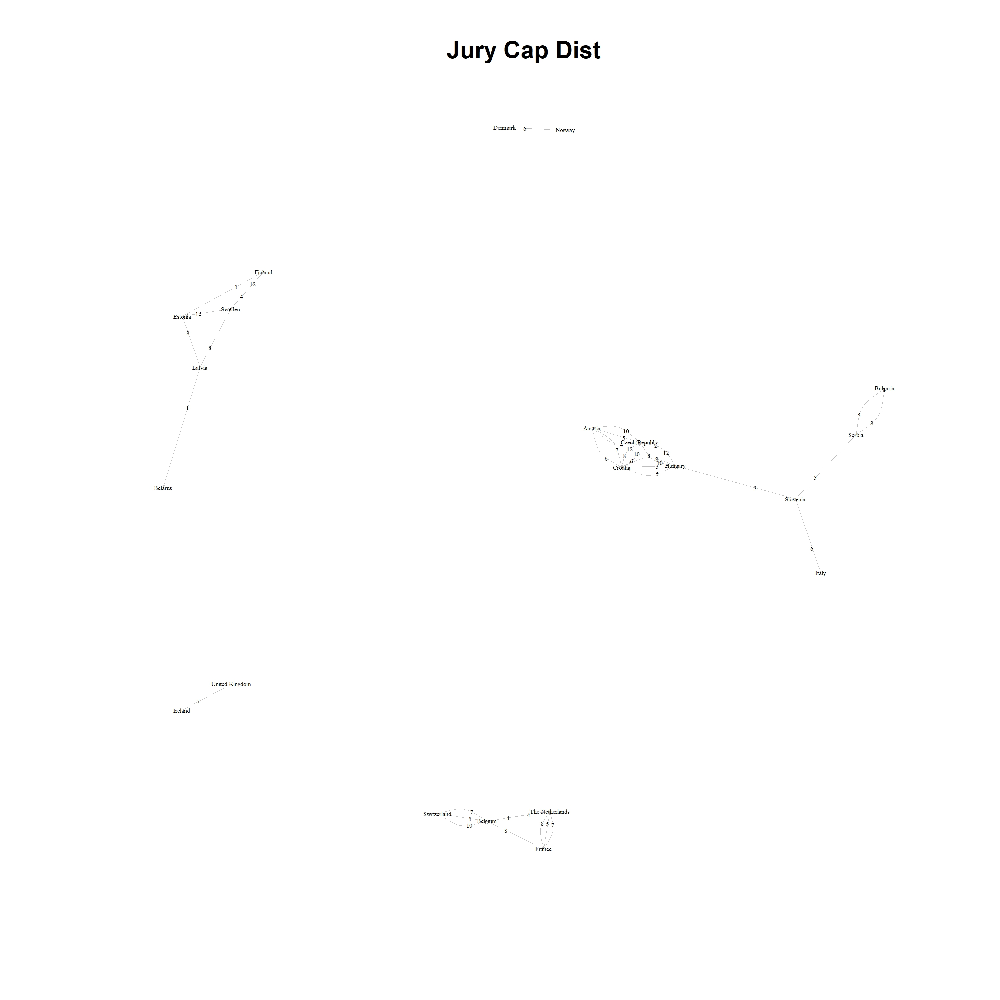
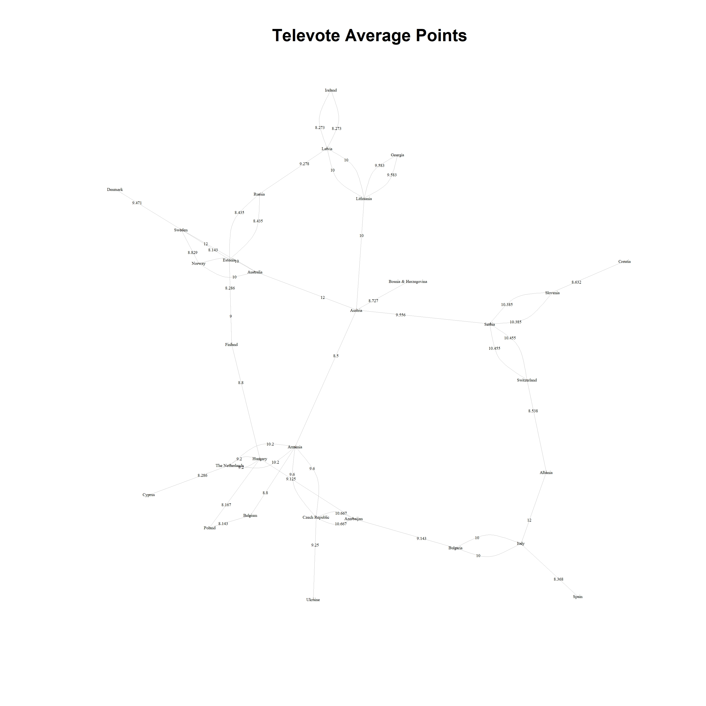

## Overview

This Rmarkdown report covers an exploratory analysis of the raw data. A variety of univariate and bivarite visualizations, and descriptive statistics are derived to better understand the underlying the structures and patterns within the raw data. Visualizations and descriptive statistics are generated for both the numeric data and the categorical variables.


```{r preliminaries, message = FALSE, echo = FALSE}
# Load in relevant libraries
library(rmarkdown)
library(knitr)
library(igraph)
library(ggplot2)
library(dplyr)

# load in custom utility functions
source("utilities/factor_descriptive_statistics.R")
source("utilities/numeric_descriptive_statistics.R")
source("utilities/plot_bar_chart.R")
source("utilities/plot_histogram.R")
source("utilities/plot_scatter.R")
source("utilities/chisq_assoc_test.R")
source("utilities/corr_tests.R")
source("utilities/pred_corr_tests.R")
source("utilities/graph_network.R")
source('cons.R')

# load in the raw ESC 2016 data for the analysis
ESCdata <- read.csv(file = "../data/ESC_2016_voting_data.csv", header = TRUE)
```

```{r data-prep, echo = FALSE}
# define vectors for all numeric columns
avg_point_num <- c('Average_Points')
mig_num <- c('FC_NonCOB', 'FC_NonCitzens', 'FC_COB', 'FC_Citizens', 'FC_Population', 'METRIC_COB', 'METRIC_Citizens', 'METRIC_COBCit')
mus_num <- c('danceability', 'loudiness', 'liveness', 'energy', 'speechiness', 'acousticness', 'instrumentalness', 'valence', 'tempo', 'duration_ms')
demo_num <- c('TC_NumNeigh', 'FC_CAP_LON', 'FC_CAP_LAT', 'TC_CAP_LON', 'TC_CAP_LAT', 'FC_GDP_mil', 'TC_GDP_mil', 'GDP_PROP', 'CAP_DIST_km')
comp_num <- c('OOA')
# consolidate all numeric columns
all_num <- c(avg_point_num, mig_num, mus_num, demo_num, comp_num)
# define vectors for all categorical columns
voting_factors <- c('From_country', 'To_country', 'Points')
comp_factors <- c('Round', 'Voting_Method', 'Host_Nation', 'OOA')
ext_factors <- c('VBlocs1_TC', 'VBlocs2_TC', 'VBlocs1_FC', 'VBlocs2_FC', 'ComVBlocs1', 'ComVBlocs2', 'FC_LANGFAM', 'TC_LANGFAM', 'ComLANGFAM', 'Neighbours', 'TC_NumNeigh')
perf_factors <- c('FC_SONGLANG', 'TC_SONGLANG','ComSONGLAN', 'TC_PerfType', 'TC_SingerGender', 'key', 'mode', 'time_signature')
# consolidate all factor columns
all_factors <- c(voting_factors, comp_factors, ext_factors, perf_factors)
```

## Descriptive Statistics

### Categorical

```{r categorical-descriptive-stats, echo = FALSE}
# run the categorical descriptive statistics function
raw_data_cat_desc_stats <- factor_descriptive_statistics(dataset = ESCdata, col_names = all_factors)
if (gen_output_report_stat_files) {
  # write the categorical descriptive statistics to disk
  write.csv(x = raw_data_cat_desc_stats, file = fpath_stats_descriptive_categorical)
}
# print descriptive statistics
raw_data_cat_desc_stats
```

### Numeric

```{r numeric-descriptive-stats, echo = FALSE}
# generate numeric descriptive statistics
raw_data_num_desc_stats <- numeric_descriptive_statistics(dataset = ESCdata, col_names = all_num)
if (gen_output_report_stat_files) {
  # write the numeric descriptive statistics to disk
  write.csv(x = raw_data_num_desc_stats, file = fpath_stats_descriptive_numeric)
}
# print descriptive statistics
raw_data_num_desc_stats
```

### Chi-Squared Tests of Association

Chi-Squared Test Hypothesis:

* Ho: x is independent of y
* Ha: x is associated with y

```{r chisq-tests, echo = FALSE}
# perform chi-sq tests of association with Points
chisqtestdf <- chisq_assoc_test(data = ESCdata, col_names = all_factors)
if (gen_output_report_stat_files) {
  # write the data frame to a csv file
  write.csv(x = chisqtestdf, file = fpath_stats_chisq_response, row.names = FALSE)
}
# show chi-sq test results
chisqtestdf
```

### Correlation Tests

Correlation Test Hypothesis:

* Ho: x is not correlated with y
* Ha: x is correlated with y

**Response Tests**

```{r correlation-resp-tests, echo = FALSE}
# execute the correlation tests against the response
resp_cor_tests_df <- corr_tests(data = ESCdata, col_names = all_num)
if (gen_output_report_stat_files) {
  # Write the correlation results to  a .csv file
  write.csv(x = resp_cor_tests_df, file = fpath_stats_cor_response, row.names = FALSE)
}
# show correlation response results
resp_cor_tests_df
```

**Predictor Tests**

```{r correlation-pred-tests, echo = FALSE}
# run correlation tests for all predictors
pred_cor_tests_df <- pred_corr_tests(ESCdata[all_num])
if (gen_output_report_stat_files) {
  # output results as a .csv file
  write.csv(x = pred_cor_tests_df, file = fpath_stats_cor_predictors, row.names = FALSE)
}
# Determine which variables are highly correlated
pred_cor_tests_df_sub <- pred_cor_tests_df[pred_cor_tests_df$Correlation > 0.4,]
row.names(pred_cor_tests_df_sub) <- NULL
pred_cor_tests_df_sub
```

## Visualizations

### Univariate Plots

```{r univariate-plots, message = FALSE, warning = FALSE, echo = FALSE, results = 'hide'}
# call bar chart plotting function
plot_bar_chart(dataset = ESCdata, col_names = all_factors, output_dir = fdir_plots_bar_charts)
# call histogram plotting function
plot_histogram(dataset = ESCdata, col_names = all_num, output_dir = fdir_plots_histograns)
```

### Bivariate

```{r bivariate-plots, message = FALSE, warning = FALSE, echo = FALSE, results = 'hide'}
# plot scatter plot
plot_scatter(data = ESCdata, col_names = all_num, output_dir = fdir_plots_scatterplots)
```

### Networks

```{r social-networks, echo = FALSE}
# NOTE: that there is more data missing for METIC_Citizens than METRIC_COB
networkdata <- ESCdata %>% filter(!is.na(METRIC_Citizens))
```

```{r metric-cob, echo = FALSE, results = 'hide'}
# (1) Voting_Method = Televote
graph_network(dataset = filter(networkdata, Voting_Method == "T" & METRIC_COB > 0.1), weights = 'Points', main = 'Televote Metric COB', output_fpath = fpath_plots_networks_cob_metric_televote)
# (2) Voting_Method = Jury
graph_network(dataset = filter(networkdata, Voting_Method == "J" & METRIC_COB > 0.1), weights = 'Points', main = 'Jury Metric COB', output_fpath = fpath_plots_networks_cob_metric_jury)
```

\newline
\newline

```{r metric-citizens, echo = FALSE, results = 'hide'}
# (1) Voting_Method = Televote
graph_network(dataset = filter(networkdata, Voting_Method == "T" & METRIC_Citizens > 0.1), weights = 'Points', main = 'Televote Metric Citizens', output_fpath = fpath_plots_networks_citizens_metric_televote)
# (2) Voting_Method = Jury
graph_network(dataset = filter(networkdata, Voting_Method == "J" & METRIC_Citizens > 0.1), weights = 'Points', main = 'Jury Metric Citizens', output_fpath = fpath_plots_networks_citizens_metric_jury)
```

\newline
\newline

```{r metric-cobcit, echo = FALSE, results = 'hide'}
# (1) Voting_Method = Televote
graph_network(dataset = filter(networkdata, Voting_Method == "T" & METRIC_COBCit > 0.15), weights = 'Points', main = 'Televote Metric COBCit', output_fpath = fpath_plots_networks_cobcit_metric_televote)
# (2) Voting_Method = Jury
graph_network(dataset = filter(networkdata, Voting_Method == "J" & METRIC_COBCit > 0.15), weights = 'Points', main = 'Jury Metric COBCit', output_fpath = fpath_plots_networks_cobcit_metric_jury)

# (1) Voting_Method = Televote & Round = sf1
graph_network(dataset = filter(networkdata, Voting_Method == "T" & METRIC_COBCit > 0.25 & Round == "sf1"), weights = 'Points', main = 'Televote Metric COBCit SF1', output_fpath = fpath_plots_networks_cobcit_sf1_metric_televote)
# (2) Voting_Method = Jury
graph_network(dataset = filter(networkdata, Voting_Method == "J" & METRIC_COBCit > 0.25 & Round == "sf1"), weights = 'Points', main = 'Jury Metric COBCit SF1', output_fpath = fpath_plots_networks_cobcit_sf1_metric_jury)
```

\newline
\newline
\newline
\newline

```{r cap-dist, echo = FALSE, results = 'hide'}
# (1) Voting_Method = Televote
graph_network(dataset = filter(networkdata, Voting_Method == "T" & CAP_DIST_km < 500), weights = 'Points', main = 'Televote Cap Dist', output_fpath = fpath_plots_networks_cap_distance_televote)
# (2) Voting_Method = Jury
graph_network(dataset = filter(networkdata, Voting_Method == "J" & CAP_DIST_km < 500), weights = 'Points', main = 'Jury Cap Dist', output_fpath = fpath_plots_networks_cap_distance_jury)
```

\newline
\newline

```{r average-points, echo = FALSE, results = 'hide'}
# (1) Voting_Method = Televote
graph_network(dataset = filter(networkdata, Voting_Method == "T" & Average_Points > 8), weights = 'Average_Points', main = 'Televote Average Points', output_fpath = fpath_plots_networks_average_points_televote)
# (2) Voting_Method = Jury
graph_network(dataset = filter(networkdata, Voting_Method == "J" & Average_Points > 8), weights = 'Average_Points', main = 'Jury Average Points', output_fpath = fpath_plots_networks_average_points_jury)
```

\newline
\newline