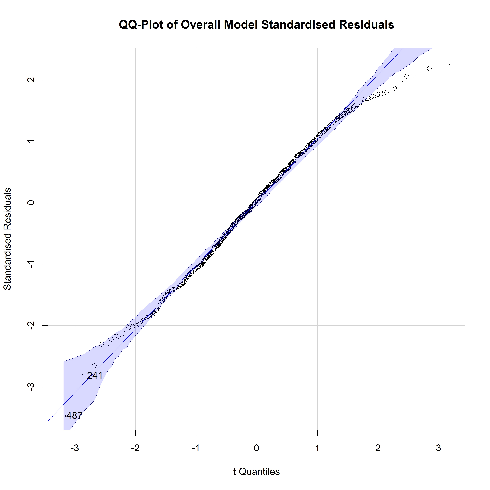
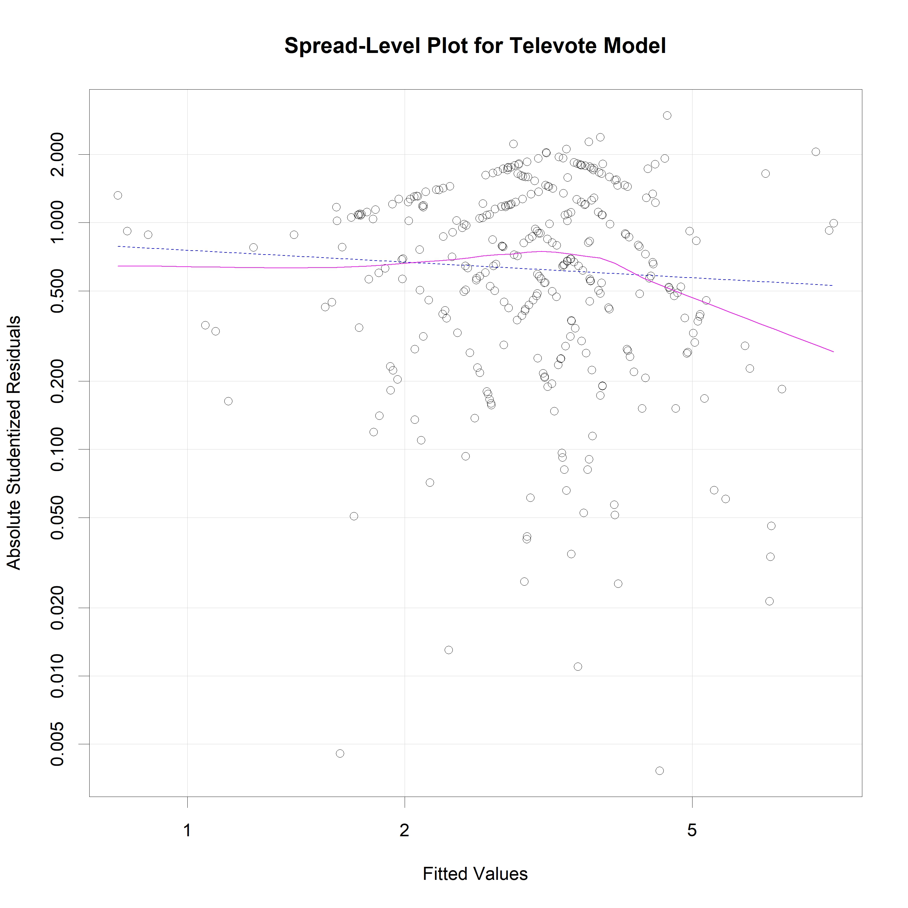
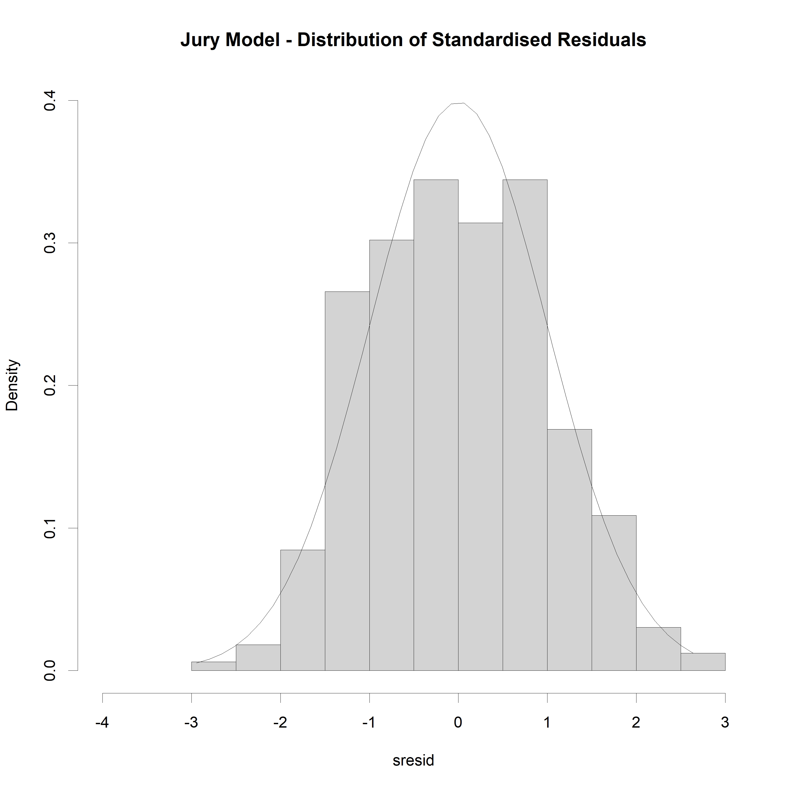

\newpage

## Overview

This section evaluates the fit of the model's using the car package. Multiple linear regression (MLR) requires the model residuals to be ~ IID N(0, sigma^2). The model residuals will be standardized for the assessment.

1. Normality Assumptions will be accessed using:
    * Normality tests from the nortest package
    * Visualizations such as histograms, QQ-plots, Residual Plots and Add Variable Plots
2. Constant Variance will be accessed using:
    * non-constant variance test
3. Multi-collinearity will be accessed using:
    * variance inflation factors
4. Outliers will be accessed using:
    * Cooks Distance

```{r preliminaries, message = FALSE, echo = FALSE, warning = FALSE}
# load relevant libraries
library(rmarkdown)
library(knitr)
library(car)
library(MASS)
library(nortest)
library(lmtest)
library(dplyr)
library(tibble)
# load custom functions
source('scripts/utilities/bonferroni_outlier_test.R')
source('scripts/utilities/sresid_outliers.R')
source('scripts/utilities/normality_tests.R')
source('scripts/utilities/ncv_test.R')
source('scripts/utilities/model_vifs.R')
source('scripts/utilities/boxcox_transplot.R')
source('scripts/utilities/plot_residuals_vs_fits.R')
source('scripts/utilities/plot_cooks.R')
source('scripts/utilities/plot_influence.R')
source('scripts/utilities/plot_residualdist.R')
source('scripts/utilities/plot_qq.R')
source('scripts/utilities/plot_spreadlevel.R')
```

```{r data-load, echo = FALSE, warning = FALSE}
# load in the historic voting data for deriving the voting blocs
processed_data <- read.csv(file = "./data/processed_data.csv", header = T)
rownames(processed_data) <- seq(1, dim(processed_data)[1])
# split the televote data
televote_data <- processed_data %>% rownames_to_column('idx') %>% filter(Voting_Method_J == 0) %>% column_to_rownames('idx')
# split out the jury vote data
jury_data <- processed_data %>% rownames_to_column('idx') %>% filter(Voting_Method_J == 1) %>% column_to_rownames('idx')
```

\newpage

## Overall Model

```{r overall-model, echo = FALSE, warning = FALSE}
# load final overall model
my_model_overall <- readRDS("./models/overall_final_model.RDS")
# extract out the model coefficients
overall_model_coeff <- names(my_model_overall$coefficients)[-1]
# recreate the model formula
overall_final_model_form<- as.formula(paste('Points ~', paste(overall_model_coeff, collapse = ' + ')))
# generate model summary
summary(my_model_overall)
```

### Box-Cox Power Transformation

```{r overall-box-cox, echo = FALSE, warning = FALSE}
# Apply box-cox transformation on the model to improve the normality assumptions 
# box-cox transformation using car
bct <- boxcox_transplot(my_model_overall, output_fpath = './report/plots/boxcox/model_overall_boxcox.jpg')
# find optimal box-cox power transformation power
p <- bct$x[which.max(x = bct$y)]
# transform points using the optimal power transformation
bctPoints <- (((processed_data$Points)^p) - 1)/(p)
# recreate the model formula
overall_final_model_bct_form<- as.formula(paste('bctPoints ~', paste(overall_model_coeff, collapse = ' + ')))
# refit final model with with box-cox power transformation
my_model_overall <- lm(formula = overall_final_model_bct_form, data = processed_data)
# generate model summary
summary(my_model_overall)
# generate standardised residuals
overall_sresid <- studres(my_model_overall)
```

\newline

### Residuals vs Fitted Values

```{r overall-residuals-vs-fits, echo = FALSE, results = 'hide'}
# plot residuals vs fits model
plot_residuals_vs_fits(model = my_model_overall, main = "Overall Model - Standardised Residuals vs Fitted Values", output_fpath = './report/plots/residual/model_overall_residuals_vs_fits.jpg')
```

\newline

### Bonferroni Outlier Test

```{r overall-bonferroni-tests, echo = FALSE}
# Assessing Outliers
# Bonferonni p-value for most extreme obs
bonferroni_outlier_test(my_model_overall)
```

### Outlier Standardised Residuals

```{r overall-residuals-outliers, echo = FALSE}
# print example outliers
head(sresid_outliers(overall_sresid, cutoff = -2))
```

### Leverage Plots

```{r overall-leverage-plots, echo = FALSE, results = 'hide'}
# leverage plots
leveragePlots(my_model_overall, ask = FALSE, layout = c(1, 1)) 
```

### Added-Variable Plots

```{r overall-added-variable-plots, echo = FALSE, results = 'hide'}
# Added variable Plots
avPlots(my_model_overall, ask = FALSE, layout = c(1, 1))
```

### Cooks Distance

```{r overall-cooks-distance, echo = FALSE, results = 'hide'}
# Cook's D plot
plot_cooks(model = my_model_overall, data = processed_data, output_fpath = './report/plots/residual/model_overall_cooks.jpg')
```

\newline

### Residual Plots

```{r overall-residual-plots, echo = FALSE, warning = FALSE, results = 'hide'}
# Residual Plots
residualPlots(my_model_overall, ask = FALSE, layout = c(1, 1))
```

### Influence Plot

```{r overall-influence-plot, echo = FALSE, results = 'hide'}
# Influence Plot 
plot_influence(model = my_model_overall, main = "Overall Model - Influence Plot", output_fpath = './report/plots/residual/model_overall_influence.jpg')
```

\newline

### Resdiaul Normality Tests

Normality Test

* Ho: The data is normally distributed
* Ha: the data is not normally distributed


```{r overall-normality-tests, echo = FALSE, warning = FALSE}
# Normality Test
normality_tests(overall_sresid)
```

### Residual Histogram

```{r overall-residual-histogram, echo = FALSE, results = 'hide'}
# plot distribution of residuals
plot_residualdist(overall_sresid, main = "Overall Model - Distribution of Standardised Residuals", output_fpath = './report/plots/residual/model_overall_residual_distribution.jpg')
```

\newline

### Residual QQ-Plot

```{r overall-residual-qqplot, echo = FALSE, warning = FALSE, results = 'hide'}
# QQ-plot of the data
plot_qq(my_model_overall, main = "QQ-Plot of Overall Model Standardised Residuals", output_fpath = './report/plots/residual/model_overall_qq.jpg')
```

\newline

### Non-Constant Variance Test

Non-Constant Error Variance Test

* Ho: constant error variance
* Ha: Non-constant error Variance


```{r overall-nonconstant-variance, echo = FALSE, warning = FALSE}
# Non-Constant Error Variance Test
ncv_test(my_model_overall)
```

### Spread-Level Plot

```{r overall-nonconstant-variance-spreadlevelplot, echo = FALSE, warning = FALSE, results = 'hide'}
# plot studentized residuals vs. fitted values 
plot_spreadlevel(my_model_overall, main = "Spread-Level Plot for Overall Model", output_fpath = './report/plots/residual/model_overall_spreadlevel.jpg')
```

\newline

### Variance Inflation Factors

```{r overall-vifs, echo = FALSE, warning = FALSE}
# Variance Inflation Factors 
model_vifs(my_model_overall)
# No signs of collinearity
```

\newpage

## Televote Model

```{r televote-model, echo = FALSE, warning = FALSE}
# load final televote model
my_model_tele <- readRDS("./models/televote_final_model.RDS")
# extract out the model coefficients
tele_model_coeff <- names(my_model_tele$coefficients)[-1]
# recreate the model formula
televote_final_model_form<- as.formula(paste('Points ~', paste(tele_model_coeff, collapse = ' + ')))
# generate model summary
summary(my_model_tele)
```

### Box-Cox Power Transformation

```{r televote-box-cox, echo = FALSE, warning = FALSE}
# Apply box-cox transformation on the model to improve the normality assumptions 
# box-cox transformation using car
bct <- boxcox_transplot(my_model_tele, output_fpath = './report/plots/boxcox/model_tele_boxcox.jpg')
# find optimal box-cox power transformation power
p <- bct$x[which.max(x = bct$y)]
# transform points using the optimal power transformation
bctPoints <- (((televote_data$Points)^p) - 1)/(p)
# recreate the model formula
televote_final_model_bct_form <- as.formula(paste('bctPoints ~', paste(tele_model_coeff, collapse = ' + ')))
# refit final model with with box-cox power transformation
my_model_tele <- lm(formula = televote_final_model_bct_form, data = televote_data)
# generate model summary
summary(my_model_tele)
# generate standardised residuals
tele_sresid <- studres(my_model_tele)
```

\newline

### Resdiaul vs Fitted Values

```{r televote-residuals-vs-fits, echo = FALSE, warning = FALSE, results = 'hide'}
# plot residuals vs fits model
plot_residuals_vs_fits(model = my_model_tele, main = "Televote Model - Standardised Residuals vs Fitted Values", output_fpath = './report/plots/residual/model_tele_residuals_vs_fits.jpg')
```

\newline

### Bonferroni Outlier Test

```{r televote-bonferroni-tests, echo = FALSE, warning = FALSE}
# Assessing Outliers
# Bonferonni p-value for most extreme obs
bonferroni_outlier_test(my_model_tele)
```

### Resdiaul Outliers

```{r televote-outliers, echo = FALSE}
# print example outliers
head(sresid_outliers(tele_sresid, cutoff = -2))
```

### Leverage Plots

```{r televote-leverage-plots, echo = FALSE, results = 'hide'}
# leverage plots
leveragePlots(my_model_tele, ask = FALSE, layout = c(1, 1)) 
```

### Added Variable Plots

```{r televote-added-variable-plots, echo = FALSE, results = 'hide'}
# Added variable Plots
avPlots(my_model_tele, ask = FALSE, layout = c(1, 1))
```

### Cooks Distance Plot

```{r televote-cooks-distance-plot, echo = FALSE, results = 'hide'}
# Cook's D plot
plot_cooks(model = my_model_tele, data = televote_data, output_fpath = './report/plots/residual/model_tele_cooks.jpg')
```
\newline

### Residual Plots

```{r televote-residual-plots, echo = FALSE, warning = FALSE, results = 'hide'}
# Residual Plots
residualPlots(my_model_tele, ask = FALSE, layout = c(1, 1))
```

### Influence Plot

```{r televote-influence-plot, echo = FALSE, results = 'hide'}
# Influence Plot 
plot_influence(model = my_model_tele, main = "Televote Model - Influence Plot", output_fpath = './report/plots/residual/model_televote_influence.jpg')
```

\newline

### Normality Tests

Normality Test

* Ho: The data is normally distributed
* Ha: the data is not normally distributed

```{r televote-normality-tests, echo = FALSE, warning = FALSE}
# Normality Test
normality_tests(tele_sresid)
```

### Residual Distribution

```{r televote-residual-histogram, echo = FALSE, results = 'hide'}
# plot distribution of residuals
plot_residualdist(tele_sresid, main = "Televote Model - Distribution of Standardised Residuals", output_fpath = './report/plots/residual/model_televote_residual_distribution.jpg')
```

\newline

### Residual QQ-Plot

```{r televote-qqplot, echo = FALSE, warning = FALSE, results = 'hide'}
# QQ-plot of the data
plot_qq(my_model_tele, main = "QQ-Plot of Televote Model Standardised Residuals", output_fpath = './report/plots/residual/model_televote_qq.jpg')
```

\newline

### Non-Constant Variance Test

Non-Constant Error Variance Test

* Ho: constant error variance
* Ha: Non-constant error Variance

```{r televote-nonconstant-variance, echo = FALSE, warning = FALSE}
# Non-Constant Error Variance Test
ncv_test(my_model_tele)
```

### Spread-Level Plot

```{r televote-spreadlevelplot, echo = FALSE, warning = FALSE, results = 'hide'}
# plot studentized residuals vs. fitted values 
plot_spreadlevel(my_model_tele, main = "Spread-Level Plot for Televote Model", output_fpath = './report/plots/residual/model_televote_spreadlevel.jpg')
```

\newline

### Variance Inflation Factors

```{r televote-vifs, echo = FALSE, warning = FALSE}
# Variance Inflation Factors 
model_vifs(my_model_tele)
# No signs of collinearity
```

\newpage

## Jury Model

```{r jury-model, echo = FALSE, warning = FALSE}
# load final televote model
my_model_jury <- readRDS("./models/jury_final_model.RDS")
# extract out the model coefficients
jury_model_coeff <- names(my_model_jury$coefficients)[-1]
# recreate the model formula
jury_final_model_form<- as.formula(paste('Points ~', paste(jury_model_coeff, collapse = ' + ')))
# generate model summary
summary(my_model_jury)
```

### Power Transformation

```{r jury-power-trans, echo = FALSE, warning = FALSE}
# transform points using the optimal power transformation
ptPoints <- jury_data$Points^(3/4)
# Note: weird bug occuring for row name 177 / row index 88 (possibly due to column with near all zero values)
jury_coeff_data <- jury_data %>% subset(select = jury_model_coeff)
jury_coeff_zero_prop <- apply(X = jury_coeff_data, MARGIN = 2, FUN = function(x) sum(x == 0)/length(x)*100)
jury_model_coeff <- names(which(jury_coeff_zero_prop < 99))
# recreate the model formula
jury_final_model_pt_form <- as.formula(paste('ptPoints ~', paste(jury_model_coeff, collapse = ' + ')))
# refit final model with power transformation of 3/4
# NOTE: a box cox transformation resulted in normality but also non-constant variance
my_model_jury <- lm(formula = jury_final_model_pt_form, data = jury_data)
# generate model summary
summary(my_model_jury)
# generate standardised residuals
jury_sresid <- studres(my_model_jury)
```

### Resdiauls vs Fitted Values

```{r jury-residuals-vs-fits, echo = FALSE, warning = FALSE, results = 'hide'}
# plot residuals vs fits model
plot_residuals_vs_fits(model = my_model_jury, main = "Jury Model - Standardised Residuals vs Fitted Values", output_fpath = './report/plots/residual/model_jury_residuals_vs_fits.jpg')
```

\newline

### Bonferroni Outlier Test

```{r jury-bonferroni-outlier-test, echo = FALSE, warning = FALSE}
# Assessing Outliers
# Bonferonni p-value for most extreme obs
bonferroni_outlier_test(my_model_jury)
```

### Outlier Resdiauls

```{r jury-outliers, echo = FALSE}
# print example outliers
head(sresid_outliers(jury_sresid, cutoff = -2))
```

### Leverage Plots

```{r jury-leverage-plots, echo = FALSE, results = 'hide'}
# leverage plots
leveragePlots(my_model_jury, ask = FALSE, layout = c(1, 1)) 
```

### Added VAriable Plots

```{r jury-added-variable-plots, echo = FALSE, results = 'hide'}
# Added variable Plots
avPlots(my_model_jury, ask = FALSE, layout = c(1, 1))
```

### Cooks Distance Plot

```{r jury-cooks-distance-plot, echo = FALSE, results = 'hide'}
# Cook's D plot
plot_cooks(model = my_model_jury, data = jury_data, output_fpath = './report/plots/residual/model_jury_cooks.jpg')
```

\newline

### Residual Plots

```{r jury-residual-plots, echo = FALSE, warning = FALSE, results = 'hide'}
# Residual Plots
residualPlots(my_model_jury, ask = FALSE, layout = c(1, 1))
```

### Influence Plot

```{r jury-influence-plot, echo = FALSE, results = 'hide'}
# Influence Plot 
plot_influence(model = my_model_jury, main = "Jury Model - Influence Plot", output_fpath = './report/plots/residual/model_jury_influence.jpg')
```

\newline

### Normality Tests

Normality Test

* Ho: The data is normally distributed
* Ha: the data is not normally distributed

```{r jury-normality-tests, echo = FALSE, warning = FALSE}
# Normality Test
normality_tests(jury_sresid)
```

### Residual Plots

```{r jury-residual-histogram, echo = FALSE, results = 'hide'}
# Influence Plot 
plot_residualdist(jury_sresid, main = "Jury Model - Distribution of Standardised Residuals", output_fpath = './report/plots/residual/model_jury_residual_distribution.jpg')
```

\newline

### Residual QQ-Plot

```{r jury-qqplot, echo = FALSE, warning = FALSE, results = 'hide'}
# QQ-plot of the data
plot_qq(my_model_jury, main = "QQ-Plot of Jury Vote Model Standardised Residuals", output_fpath = './report/plots/residual/model_jury_qq.jpg')
```

\newline

### Non-Constant Variance Test

Non-Constant Error Variance Test

* Ho: constant error variance
* Ha: Non-constant error Variance

```{r jury-nonconstant-variance, echo = FALSE, warning = FALSE}
# Non-Constant Error Variance Test
ncv_test(my_model_jury)
```

### Spread-Level Plot

```{r jury-spreadlevelplot, echo = FALSE, warning = FALSE, results = 'hide'}
# plot studentized residuals vs. fitted values 
plot_spreadlevel(my_model_jury, main = "Spread-Level Plot for Jury Model", output_fpath = './report/plots/residual/model_jury_spreadlevel.jpg')
```

\newline

### Variance Influation Factors

```{r jury-vifs, echo = FALSE, warning = FALSE}
# Variance Inflation Factors 
model_vifs(my_model_jury)
# No signs of collinearity
```
